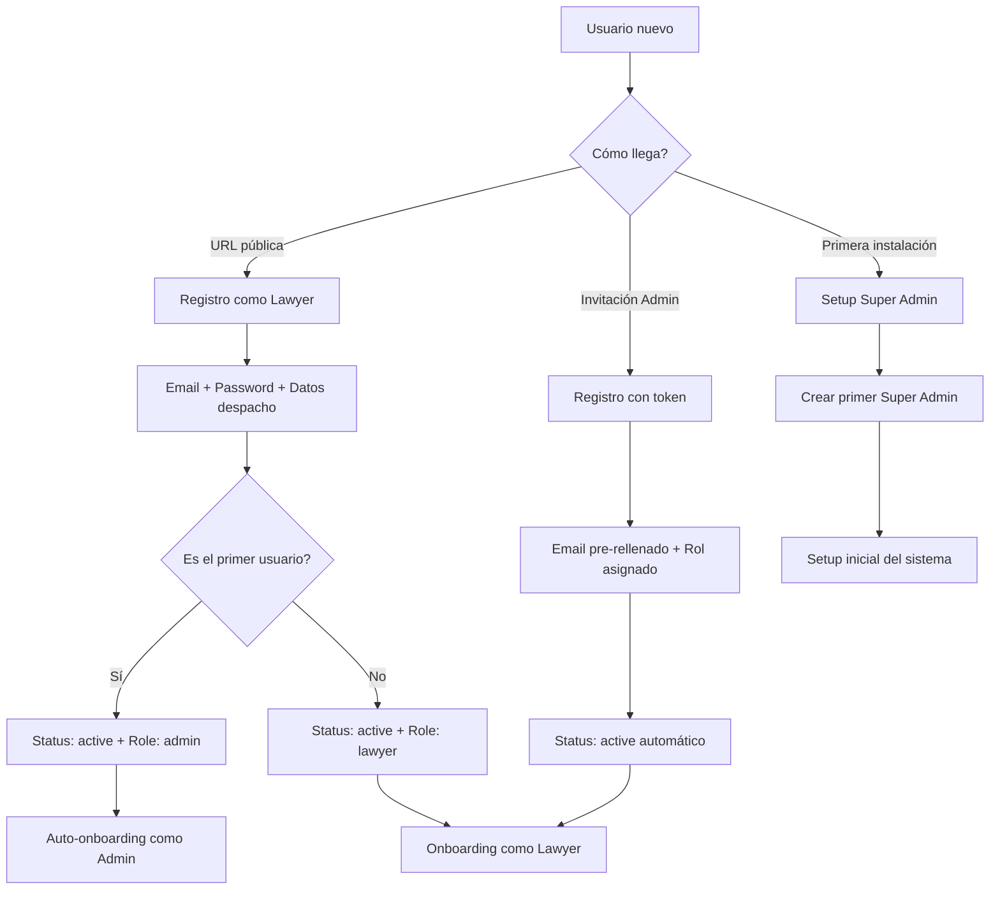

# 🏛️ Propuesta: Flujo Admin-Abogado | Sistema Sala Cliente

> **Objetivo**: Conectar coherentemente el flujo de administrador con el flujo del abogado, estableciendo roles, permisos, datos necesarios y experiencia de usuario completa.

---

## 📋 Tabla de Contenidos

1. [Análisis de Estado Actual](#1-análisis-de-estado-actual)
2. [Arquitectura de Roles Propuesta](#2-arquitectura-de-roles-propuesta)
3. [Flujo de Registro y Onboarding](#3-flujo-de-registro-y-onboarding)
4. [Flujo de Login y Autenticación](#4-flujo-de-login-y-autenticación)
5. [Datos Requeridos por Rol](#5-datos-requeridos-por-rol)
6. [Esquema de Base de Datos](#6-esquema-de-base-de-datos)
7. [Permisos y Autorización](#7-permisos-y-autorización)
8. [Interfaz de Usuario (UI/UX)](#8-interfaz-de-usuario-uiux)
9. [Plan de Implementación](#9-plan-de-implementación)

---

## 1. Análisis de Estado Actual

### ✅ Lo que ya existe:

**Base de Datos:**
- ✅ Tabla `profiles` (perfil de despacho)
- ✅ Autenticación Supabase Auth completa
- ✅ RLS policies para aislamiento de datos
- ✅ Trigger `handle_new_user()` que crea perfil automáticamente

**UI/Componentes:**
- ✅ `RegisterForm` para registro de abogados
- ✅ Layouts separados: `(dashboard)` y `(admin)`
- ✅ `AdminSidebar` con panel admin, usuarios, auditoría
- ✅ `UsersTable` para gestión de usuarios

**Routing:**
- ✅ `/dashboard/*` - Panel del abogado
- ✅ `/admin/*` - Panel de administrador
- ✅ Middleware de autenticación funcionando

### ❌ Lo que falta:

**Roles y Permisos:**
- ❌ No existe campo `role` en `profiles` o `auth.users`
- ❌ No hay diferenciación entre admin y lawyer
- ❌ Admin panel no tiene datos reales (mock data)
- ❌ No hay sistema de permisos granular

**Flujos de Usuario:**
- ❌ No hay proceso de aprobación de abogados
- ❌ No hay configuración de planes (free/pro)
- ❌ No hay límites basados en rol
- ❌ No hay onboarding diferenciado

**Gestión:**
- ❌ Admin no puede crear/editar usuarios
- ❌ No hay sistema de invitaciones
- ❌ No hay auditoría real implementada

---

## 2. Arquitectura de Roles Propuesta

### Roles del Sistema

```typescript
type UserRole = 'super_admin' | 'admin' | 'lawyer' | 'collaborator'
type UserStatus = 'active' | 'suspended' | 'deleted' // ✅ Removed 'pending' (auto-aprobación)
type SubscriptionPlan = 'free' | 'professional' | 'enterprise'
```

#### 🛡️ Super Admin (super_admin)
- **Quién**: Desarrolladores/fundadores del sistema
- **Acceso**: Todo el sistema, todas las organizaciones
- **Capacidades**:
  - Crear/eliminar administradores
  - Ver todas las métricas globales
  - Gestionar configuración del sistema
  - Acceder a logs de servidor
  - **UI única**: Dashboard con métricas de SaaS

#### 👔 Admin (admin)
- **Quién**: Administrador de una organización/firma legal
- **Acceso**: Solo su organización y usuarios
- **Capacidades**:
  - Crear/invitar abogados
  - Ver dashboard de la firma
  - Gestionar planes y facturación
  - Ver auditoría de la organización
  - Configurar plantillas compartidas
  - **UI**: Panel admin actual + configuración de firma

#### ⚖️ Lawyer (lawyer) - **ROL PRINCIPAL**
- **Quién**: Abogado usando el sistema
- **Acceso**: Solo sus propios clientes y datos
- **Capacidades**:
  - Crear salas para clientes
  - Gestionar plantillas personales
  - Ver su propio dashboard
  - Configurar su perfil
  - **UI**: Dashboard actual de `/dashboard`

#### 👥 Collaborator (collaborator) - **FUTURO**
- **Quién**: Asistente/secretario de abogado
- **Acceso**: Clientes asignados por el abogado
- **Capacidades** (solo lectura/limitadas):
  - Ver clientes asignados
  - Enviar recordatorios
  - Descargar documentos
  - **UI**: Dashboard simplificado

---

## 3. Flujo de Registro y Onboarding

### 🎯 Estrategia: Auto-registro ACTIVO + Primer Usuario Auto-Admin

> **⚠️ CAMBIO CRÍTICO**: Eliminado `pending_approval` para evitar la "Paradoja del Primer Admin"



**Racionalización:**
1. ✅ **Sin cuello de botella**: No hay estado "pending" que bloquee usuarios
2. ✅ **Primer usuario = Admin**: Auto-promoción para evitar paradoja
3. ✅ **Resto = Lawyers activos**: Acceso inmediato a la plataforma
4. ✅ **Control por invitación**: Admin puede invitar colaboradores específicos

### Paso 1: Registro Público (Lawyer)

**URL**: `/register`

**Datos requeridos**:
1. Email (único, validado)
2. Contraseña (min 8 caracteres, validación fuerte)
3. Nombre del despacho
4. Nombre completo del abogado
5. Cédula profesional (opcional pero recomendado)
6. Teléfono de contacto
7. Aceptación de términos y condiciones

**Flujo UI** (shadcn components):
```tsx
<Card> // shadcn Card
  <CardHeader>
    <CardTitle>Crear cuenta | Sala Cliente</CardTitle>
    <CardDescription>Comienza a gestionar tus clientes digitalmente</CardDescription>
  </CardHeader>
  <CardContent>
    <Form> // shadcn Form
      <FormField name="email">
        <Input type="email" /> // shadcn Input
      </FormField>
      <FormField name="password">
        <Input type="password" />
      </FormField>
      <FormField name="firmName">
        <Input />
      </FormField>
      <FormField name="fullName">
        <Input />
      </FormField>
      <FormField name="licenseNumber">
        <Input placeholder="Cédula profesional (opcional)" />
      </FormField>
      <FormField name="phone">
        <Input type="tel" />
      </FormField>
      <Checkbox> // shadcn Checkbox
        Acepto términos y condiciones
      </Checkbox>
      <Button type="submit" disabled={loading}>
        {loading && <Loader2 className="animate-spin" />}
        Crear cuenta
      </Button>
    </Form>
  </CardContent>
</Card>
```

**Backend** (al registrarse):
```typescript
// 1. Crear usuario en Supabase Auth
const { data: authUser, error } = await supabase.auth.signUp({
  email,
  password,
  options: {
    data: {
      full_name: fullName,
      firm_name: firmName,
    }
  }
})

if (error) throw error

// 2. El trigger handle_new_user() crea el perfil automáticamente

// 3. ✅ SOLUCIÓN SEGURA: Cada registro público crea su propia organización
// NUNCA intentar buscar organizaciones existentes por nombre/slug (riesgo de colisión)
// Solo permitir "unirse" a organizaciones existentes vía invitación con token

const slug = await generateUniqueSlug(firmName) // Agregar sufijo numérico si existe

const { data: newOrg, error: orgError } = await supabase
  .from('organizations')
  .insert({
    name: firmName,
    slug: slug, // Slug único con sufijo si hay colisión
    owner_id: authUser.id,
  })
  .select('id')
  .single()

if (orgError) throw orgError

const organizationId = newOrg.id
const isFirstUserInOrg = true // Siempre es primer usuario de SU propia org

// 4. Actualizar perfil con datos adicionales y asignar rol
await supabase
  .from('profiles')
  .update({
    full_name: fullName,
    license_number: licenseNumber,
    phone: phone,
    organization_id: organizationId,
    role: 'admin', // ✅ Primer usuario de registro público = Admin de su propia org
    status: 'active',
    subscription_plan: 'free',
    onboarding_completed: false
  })
  .eq('user_id', authUser.id)

// Helper function para generar slugs únicos
async function generateUniqueSlug(firmName: string): Promise<string> {
  let baseSlug = slugify(firmName)
  let slug = baseSlug
  let counter = 1
  
  while (true) {
    const { count } = await supabase
      .from('organizations')
      .select('*', { count: 'exact', head: true })
      .eq('slug', slug)
    
    if (count === 0) break // Slug disponible
    
    slug = `${baseSlug}-${counter}` // perez-abogados-2
    counter++
  }
  
  return slug
}
```

**Post-registro**:
- ✅ Email de bienvenida con verificación
- ✅ Acceso inmediato a onboarding (sin espera)
- ✅ Si es primer usuario: Notificación de "¡Eres el administrador!"
- ✅ Analytics: Notificación interna de nuevo registro

### Paso 2: Registro por Invitación (Admin invita a Lawyer)

**URL**: `/register?token={invitation_token}`

**Flujo**:
1. Admin envía invitación desde panel `/admin/usuarios`
2. Se genera token único y se guarda en tabla `invitations`
3. Email con link mágico al abogado invitado
4. Al hacer clic, registro simplificado (email pre-rellenado, rol pre-asignado)
5. Status `active` automáticamente

**Ventajas**:
- No requiere aprobación manual
- Email ya verificado (confía en el admin)
- Puede asignar rol específico (lawyer/collaborator)

### Paso 3: Onboarding Post-Aprobación

Una vez aprobado (status `active`), onboarding multi-step:

**Pantalla**: `/onboarding`

```tsx
<Tabs value={step}> // shadcn Tabs
  <TabsList>
    <TabsTrigger value="welcome">Bienvenida</TabsTrigger>
    <TabsTrigger value="profile">Perfil</TabsTrigger>
    <TabsTrigger value="templates">Plantillas</TabsTrigger>
    <TabsTrigger value="tour">Tour</TabsTrigger>
  </TabsList>

  <TabsContent value="welcome">
    <Card>
      <CardHeader>
        <CardTitle>¡Bienvenido a Sala Cliente!</CardTitle>
      </CardHeader>
      <CardContent>
        <p>Vamos a configurar tu cuenta en 3 pasos...</p>
        <Button onClick={nextStep}>Comenzar</Button>
      </CardContent>
    </Card>
  </TabsContent>

  <TabsContent value="profile">
    {/* Completar perfil: logo, bio, URL personalizada */}
  </TabsContent>

  <TabsContent value="templates">
    {/* Crear primera plantilla de contrato/cuestionario */}
  </TabsContent>

  <TabsContent value="tour">
    {/* Video tutorial o tour interactivo */}
  </TabsContent>
</Tabs>
```

---

## 4. Flujo de Login y Autenticación

### Login Unificado

**URL**: `/login`

**Single Sign-On**: Mismo formulario para todos los roles

```tsx
<Card className="w-full max-w-md">
  <CardHeader>
    <CardTitle>Iniciar sesión</CardTitle>
    <CardDescription>
      Ingresa a tu panel de Sala Cliente
    </CardDescription>
  </CardHeader>
  <CardContent>
    <Form>
      <FormField name="email">
        <Input type="email" placeholder="correo@ejemplo.com" />
      </FormField>
      <FormField name="password">
        <Input type="password" placeholder="••••••••" />
      </FormField>
      <div className="flex items-center justify-between">
        <div className="flex items-center gap-2">
          <Checkbox id="remember" />
          <Label htmlFor="remember">Recordarme</Label>
        </div>
        <Link href="/forgot-password">
          <Button variant="link">¿Olvidaste tu contraseña?</Button>
        </Link>
      </div>
      <Button type="submit" className="w-full">
        Iniciar sesión
      </Button>
    </Form>
    <Separator className="my-4" />
    <p className="text-center text-sm">
      ¿No tienes cuenta?{" "}
      <Link href="/register">
        <Button variant="link">Regístrate aquí</Button>
      </Link>
    </p>
  </CardContent>
</Card>
```

### Redirección Inteligente Post-Login

**Middleware** (actualizar `src/middleware.ts`):

```typescript
export async function middleware(request: NextRequest) {
  const response = await updateSession(request)
  const { user } = await supabase.auth.getUser()

  if (!user) return response

  // Obtener perfil y rol
  const { data: profile } = await supabase
    .from('profiles')
    .select('role, status, onboarding_completed')
    .eq('user_id', user.id)
    .single()

  if (!profile) return NextResponse.redirect('/logout')

  // Validar status de cuenta
  if (profile.status === 'suspended') {
    return NextResponse.redirect('/account-suspended')
  }
  // ✅ REMOVED: pending_approval (auto-aprobación activa)

  // Redirigir por rol
  const pathname = request.nextUrl.pathname

  // Si está en login y ya autenticado, redirigir a su dashboard
  if (pathname === '/login') {
    if (!profile.onboarding_completed) {
      return NextResponse.redirect('/onboarding')
    }
    
    switch (profile.role) {
      case 'super_admin':
        return NextResponse.redirect('/admin/system')
      case 'admin':
        return NextResponse.redirect('/admin')
      case 'lawyer':
      case 'collaborator':
        return NextResponse.redirect('/dashboard')
    }
  }

  // Proteger rutas de admin
  if (pathname.startsWith('/admin')) {
    if (!['admin', 'super_admin'].includes(profile.role)) {
      return NextResponse.redirect('/dashboard')
    }
  }

  // Proteger rutas de super admin
  if (pathname.startsWith('/admin/system')) {
    if (profile.role !== 'super_admin') {
      return NextResponse.redirect('/admin')
    }
  }

  return response
}
```

---

## 5. Datos Requeridos por Rol

### Super Admin
```typescript
interface SuperAdminProfile {
  // Hereda de Profile base
  role: 'super_admin'
  permissions: string[] // ['manage_admins', 'view_analytics', 'system_config']
  can_impersonate: boolean // Para debugging
}
```

**Panel específico**:
- Métricas globales (total usuarios, planes, facturación)
- Gestión de administradores
- Configuración del sistema (SMTP, Storage, API keys)
- Logs y monitoreo

### Admin (Organizacional)
```typescript
interface AdminProfile {
  // Hereda de Profile base
  role: 'admin'
  organization_id: string // FK a organizations table
  permissions: string[] // ['invite_lawyers', 'view_org_stats', 'manage_billing']
  can_manage_lawyers: boolean
  can_view_all_clients: boolean
}
```

**Datos adicionales**:
- Nombre de la organización/firma
- NIF/RFC de la empresa
- Dirección fiscal
- Datos de facturación
- Límites del plan (max_lawyers, max_clients, storage_gb)

**Panel específico**:
- Dashboard de la firma (todos los abogados)
- Gestión de miembros del equipo
- Plantillas compartidas de la firma
- Configuración de marca (logo, colores)
- Facturación y plan

### Lawyer (Usuario principal)
```typescript
interface LawyerProfile {
  // Datos personales
  role: 'lawyer'
  full_name: string
  license_number?: string // Cédula profesional
  phone: string
  bio?: string
  profile_photo_url?: string
  
  // Datos del despacho
  firm_name: string
  firm_logo_url?: string
  firm_website?: string
  calendar_link?: string
  
  // Control de cuenta
  status: UserStatus
  subscription_plan: SubscriptionPlan
  trial_ends_at?: Date
  subscription_expires_at?: Date
  
  // Límites del plan
  max_clients: number
  max_storage_mb: number
  current_clients_count: number
  current_storage_mb: number
  
  // Preferencias
  timezone: string
  language: string
  email_notifications: boolean
  
  // Metadata
  onboarding_completed: boolean
  last_login_at: Date
  created_at: Date
}
```

**Panel específico**:
- Dashboard personal (mis clientes)
- Gestión de salas
- Plantillas personales
- Perfil y configuración

---

## 6. Esquema de Base de Datos

### Nuevas tablas necesarias

#### `organizations` (para Admin multi-tenant)
```sql
CREATE TABLE IF NOT EXISTS public.organizations (
    id UUID PRIMARY KEY DEFAULT extensions.uuid_generate_v4(),
    name TEXT NOT NULL,
    slug TEXT UNIQUE NOT NULL, -- URL-friendly: "despacho-lopez"
    tax_id TEXT, -- RFC/NIF
    billing_address JSONB,
    
    -- Branding
    logo_url TEXT,
    primary_color TEXT DEFAULT '#000000',
    secondary_color TEXT DEFAULT '#FFFFFF',
    
    -- Plan y límites
    subscription_plan TEXT DEFAULT 'free' CHECK (subscription_plan IN ('free', 'professional', 'enterprise')),
    max_lawyers INTEGER DEFAULT 1,
    max_clients_per_lawyer INTEGER DEFAULT 10,
    max_storage_gb INTEGER DEFAULT 5,
    
    -- Control
    status TEXT DEFAULT 'active' CHECK (status IN ('active', 'suspended', 'cancelled')),
    owner_id UUID REFERENCES auth.users(id),
    
    created_at TIMESTAMPTZ DEFAULT NOW(),
    updated_at TIMESTAMPTZ DEFAULT NOW()
);

CREATE INDEX idx_organizations_slug ON public.organizations(slug);
CREATE INDEX idx_organizations_owner_id ON public.organizations(owner_id);
```

#### `profiles` (actualizar tabla existente)
```sql
-- Agregar nuevas columnas a profiles
ALTER TABLE public.profiles
ADD COLUMN IF NOT EXISTS role TEXT DEFAULT 'lawyer' CHECK (role IN ('super_admin', 'admin', 'lawyer', 'collaborator')),
ADD COLUMN IF NOT EXISTS status TEXT DEFAULT 'active' CHECK (status IN ('active', 'suspended', 'deleted')), -- ✅ Auto-aprobación
ADD COLUMN IF NOT EXISTS organization_id UUID REFERENCES organizations(id),
ADD COLUMN IF NOT EXISTS full_name TEXT,
ADD COLUMN IF NOT EXISTS license_number TEXT,
ADD COLUMN IF NOT EXISTS phone TEXT,
ADD COLUMN IF NOT EXISTS bio TEXT,
ADD COLUMN IF NOT EXISTS profile_photo_url TEXT,
ADD COLUMN IF NOT EXISTS subscription_plan TEXT DEFAULT 'free' CHECK (subscription_plan IN ('free', 'professional', 'enterprise')),
ADD COLUMN IF NOT EXISTS trial_ends_at TIMESTAMPTZ,
ADD COLUMN IF NOT EXISTS subscription_expires_at TIMESTAMPTZ,
ADD COLUMN IF NOT EXISTS max_clients INTEGER DEFAULT 10,
ADD COLUMN IF NOT EXISTS max_storage_mb INTEGER DEFAULT 100,
ADD COLUMN IF NOT EXISTS timezone TEXT DEFAULT 'America/Mexico_City',
ADD COLUMN IF NOT EXISTS language TEXT DEFAULT 'es',
ADD COLUMN IF NOT EXISTS email_notifications BOOLEAN DEFAULT TRUE,
ADD COLUMN IF NOT EXISTS onboarding_completed BOOLEAN DEFAULT FALSE,
ADD COLUMN IF NOT EXISTS last_login_at TIMESTAMPTZ,
ADD COLUMN IF NOT EXISTS approved_by UUID REFERENCES auth.users(id),
ADD COLUMN IF NOT EXISTS approved_at TIMESTAMPTZ;

CREATE INDEX idx_profiles_role ON public.profiles(role);
CREATE INDEX idx_profiles_status ON public.profiles(status);
CREATE INDEX idx_profiles_organization_id ON public.profiles(organization_id);
```

#### `invitations` (para invitar usuarios)
```sql
CREATE TABLE IF NOT EXISTS public.invitations (
    id UUID PRIMARY KEY DEFAULT extensions.uuid_generate_v4(),
    email TEXT NOT NULL,
    role TEXT NOT NULL CHECK (role IN ('lawyer', 'collaborator')),
    organization_id UUID REFERENCES organizations(id),
    invited_by UUID REFERENCES auth.users(id) NOT NULL,
    invitation_token TEXT UNIQUE NOT NULL,
    invited_email_match_required BOOLEAN DEFAULT TRUE, -- ✅ Seguridad: Validar email exacto
    expires_at TIMESTAMPTZ NOT NULL DEFAULT (NOW() + INTERVAL '7 days'),
    accepted_at TIMESTAMPTZ,
    revoked_at TIMESTAMPTZ,
    created_at TIMESTAMPTZ DEFAULT NOW()
);

CREATE INDEX idx_invitations_email ON public.invitations(email);
CREATE INDEX idx_invitations_token ON public.invitations(invitation_token);
CREATE INDEX idx_invitations_organization_id ON public.invitations(organization_id);

-- ✅ Función de validación segura de invitaciones
CREATE OR REPLACE FUNCTION validate_invitation_token(
  token TEXT,
  user_email TEXT
) RETURNS BOOLEAN AS $$
DECLARE
  inv invitations;
BEGIN
  SELECT * INTO inv 
  FROM invitations 
  WHERE invitation_token = token
    AND expires_at > NOW()
    AND accepted_at IS NULL
    AND revoked_at IS NULL;
  
  IF inv IS NULL THEN
    RAISE EXCEPTION 'Invalid or expired invitation token';
  END IF;
  
  -- VALIDACIÓN CRÍTICA: Email debe coincidir EXACTAMENTE
  IF inv.invited_email_match_required AND LOWER(inv.email) != LOWER(user_email) THEN
    RAISE EXCEPTION 'This invitation was sent to % but you are attempting to use it with %. Please use the correct email address or request a new invitation.',
      inv.email, user_email;
  END IF;
  
  RETURN TRUE;
END;
$$ LANGUAGE plpgsql SECURITY DEFINER;
```

#### 💾 Control de Storage Quotas

> **⚠️ PROBLEMA**: Supabase Storage NO respeta límites automáticamente. Un usuario podría subir 1TB si no lo previenes.

**Solución**: Trigger en `storage.objects` para bloquear subidas que excedan cuota:

```sql
-- Trigger para enforcar límites de almacenamiento
CREATE OR REPLACE FUNCTION check_storage_quota()
RETURNS TRIGGER AS $$
DECLARE
  org_id uuid;
  current_usage bigint;
  max_allowed bigint;
  file_size bigint;
BEGIN
  -- Obtener tamaño del archivo
  file_size := (NEW.metadata->>'size')::bigint;
  
  -- Obtener organization_id y límite del usuario
  SELECT 
    COALESCE(p.organization_id, p.user_id), -- Si no tiene org, usar su user_id
    COALESCE(o.max_storage_gb, p.max_storage_mb / 1024.0) * 1073741824 -- GB a bytes
  INTO org_id, max_allowed
  FROM profiles p
  LEFT JOIN organizations o ON o.id = p.organization_id
  WHERE p.user_id = NEW.owner;

  -- Calcular uso actual de la organización/usuario
  SELECT COALESCE(SUM((metadata->>'size')::bigint), 0)
  INTO current_usage
  FROM storage.objects so
  JOIN profiles p ON p.user_id = so.owner
  WHERE COALESCE(p.organization_id, p.user_id) = org_id;

  -- Bloquear si excede límite
  IF (current_usage + file_size) > max_allowed THEN
    RAISE EXCEPTION 'Storage quota exceeded. Current: % MB, Limit: % MB, Attempting to add: % MB', 
      ROUND(current_usage::numeric / 1048576, 2),
      ROUND(max_allowed::numeric / 1048576, 2),
      ROUND(file_size::numeric / 1048576, 2)
    USING HINT = 'Please delete old files or upgrade your plan';
  END IF;

  RETURN NEW;
END;
$$ LANGUAGE plpgsql SECURITY DEFINER;

CREATE TRIGGER enforce_storage_quota
  BEFORE INSERT ON storage.objects
  FOR EACH ROW EXECUTE FUNCTION check_storage_quota();

-- Permisos para que RLS pueda ejecutar
GRANT SELECT ON storage.objects TO authenticated;

-- ✅ CRÍTICO: Trigger para UPDATE (reemplazo de archivos)
-- Sin esto, un usuario puede reemplazar un archivo de 1KB con 1GB y bypassear la cuota
CREATE OR REPLACE FUNCTION check_storage_quota_on_update()
RETURNS TRIGGER AS $$
DECLARE
  org_id uuid;
  current_usage bigint;
  max_allowed bigint;
  old_file_size bigint;
  new_file_size bigint;
  size_delta bigint;
BEGIN
  -- Obtener tamaños de archivo (viejo y nuevo)
  old_file_size := (OLD.metadata->>'size')::bigint;
  new_file_size := (NEW.metadata->>'size')::bigint;
  size_delta := new_file_size - old_file_size;
  
  -- Si el archivo nuevo es más pequeño, no hay problema
  IF size_delta <= 0 THEN
    RETURN NEW;
  END IF;
  
  -- Obtener organization_id y límite del usuario
  SELECT 
    COALESCE(p.organization_id, p.user_id),
    COALESCE(o.max_storage_gb, p.max_storage_mb / 1024.0) * 1073741824
  INTO org_id, max_allowed
  FROM profiles p
  LEFT JOIN organizations o ON o.id = p.organization_id
  WHERE p.user_id = NEW.owner;

  -- Calcular uso actual (sin contar el archivo viejo que será reemplazado)
  SELECT COALESCE(SUM((metadata->>'size')::bigint), 0) - old_file_size
  INTO current_usage
  FROM storage.objects so
  JOIN profiles p ON p.user_id = so.owner
  WHERE COALESCE(p.organization_id, p.user_id) = org_id;

  -- Bloquear si excede límite con el nuevo archivo
  IF (current_usage + new_file_size) > max_allowed THEN
    RAISE EXCEPTION 'Storage quota exceeded on file update. Current: % MB, Limit: % MB, File size change: +% MB', 
      ROUND(current_usage::numeric / 1048576, 2),
      ROUND(max_allowed::numeric / 1048576, 2),
      ROUND(size_delta::numeric / 1048576, 2)
    USING HINT = 'The new file is larger than the old one. Please delete other files first or upgrade your plan';
  END IF;

  RETURN NEW;
END;
$$ LANGUAGE plpgsql SECURITY DEFINER;

CREATE TRIGGER enforce_storage_quota_update
  BEFORE UPDATE ON storage.objects
  FOR EACH ROW 
  WHEN (OLD.metadata IS DISTINCT FROM NEW.metadata) -- Solo ejecutar si cambia el metadata
  EXECUTE FUNCTION check_storage_quota_on_update();
```

#### `permissions` (sistema de permisos granular)
```sql
CREATE TABLE IF NOT EXISTS public.permissions (
    id UUID PRIMARY KEY DEFAULT extensions.uuid_generate_v4(),
    name TEXT UNIQUE NOT NULL, -- 'create_clients', 'delete_clients', 'manage_templates'
    description TEXT,
    category TEXT, -- 'clients', 'templates', 'admin', 'system'
    created_at TIMESTAMPTZ DEFAULT NOW()
);

CREATE TABLE IF NOT EXISTS public.role_permissions (
    role TEXT NOT NULL CHECK (role IN ('super_admin', 'admin', 'lawyer', 'collaborator')),
    permission_id UUID REFERENCES permissions(id) ON DELETE CASCADE,
    PRIMARY KEY (role, permission_id)
);

-- Insertar permisos base
INSERT INTO public.permissions (name, description, category) VALUES
('create_clients', 'Crear nuevas salas de clientes', 'clients'),
('view_clients', 'Ver salas de clientes', 'clients'),
('edit_clients', 'Editar salas de clientes', 'clients'),
('delete_clients', 'Eliminar salas de clientes', 'clients'),
('manage_templates', 'Gestionar plantillas', 'templates'),
('invite_users', 'Invitar nuevos usuarios', 'admin'),
('manage_users', 'Gestionar usuarios de la organización', 'admin'),
('view_analytics', 'Ver analíticas y reportes', 'admin'),
('manage_billing', 'Gestionar facturación y planes', 'admin'),
('system_config', 'Configurar sistema global', 'system');
```

---

## 7. Permisos y Autorización

### Matriz de Permisos

| Permiso | Super Admin | Admin | Lawyer | Collaborator |
|---------|-------------|-------|--------|--------------|
| **Sistema** ||||
| system_config | ✅ | ❌ | ❌ | ❌ |
| view_all_orgs | ✅ | ❌ | ❌ | ❌ |
| **Organización** ||||
| manage_org | ✅ | ✅ | ❌ | ❌ |
| invite_users | ✅ | ✅ | ❌ | ❌ |
| manage_users | ✅ | ✅ | ❌ | ❌ |
| view_org_analytics | ✅ | ✅ | ❌ | ❌ |
| manage_billing | ✅ | ✅ | ❌ | ❌ |
| **Clientes** ||||
| create_clients | ✅ | ✅ | ✅ | ❌ |
| view_own_clients | ✅ | ✅ | ✅ | ✅ |
| view_all_clients | ✅ | ✅ | ❌ | ❌ |
| edit_own_clients | ✅ | ✅ | ✅ | ❌ |
| edit_all_clients | ✅ | ✅ | ❌ | ❌ |
| delete_own_clients | ✅ | ✅ | ✅ | ❌ |
| delete_all_clients | ✅ | ✅ | ❌ | ❌ |
| **Plantillas** ||||
| manage_own_templates | ✅ | ✅ | ✅ | ❌ |
| manage_org_templates | ✅ | ✅ | ❌ | ❌ |

### 🚀 Optimización Crítica: Custom Claims en JWT

> **⚡ IMPORTANTE**: Según [benchmarks de Supabase](https://supabase.com/docs/guides/database/postgres/row-level-security#rls-performance-recommendations), policies con JOINs complejos pueden ser **hasta 99.94% más lentas**.

> **⚠️ ADVERTENCIA CRÍTICA - JWT Staleness**: Los JWT tokens tienen una vida útil de **1 hora por defecto**. Según la [documentación oficial de Custom Claims](https://supabase.com/docs/guides/database/postgres/custom-claims-and-role-based-access-control-rbac#accessing-custom-claims-in-your-application):
> 
> *"Keep in mind that a JWT is not always 'fresh'. Even if you remove a user from a team and update the `app_metadata` field, that will not be reflected using `auth.jwt()` until the user's JWT is refreshed."*
> 
> **Impacto**: Si cambias el rol de un usuario de `lawyer` a `admin`, el cambio NO será visible hasta que el token se refresque (máximo 1 hora).
> 
> **Estrategias de mitigación**:
> 1. **Force refresh**: Llamar `supabase.auth.refreshSession()` después de cambios críticos de rol
> 2. **Reduce TTL**: Configurar tokens con vida útil de 5-15 minutos (trade-off: más requests de refresh)
> 3. **UI Warning**: Mostrar mensaje "Los cambios tardan hasta 1 hora en aplicarse"
> 4. **Hybrid**: Para cambios críticos (suspender cuenta), forzar logout y re-login
> 
> **Recomendación**: Implementar opción #1 (force refresh) para cambios de rol + opción #3 (UI warning) como respaldo.

**Problema**: Política RLS con JOIN a `profiles`:
```sql
-- ❌ LENTO: 11,000ms con 1000 clientes
CREATE POLICY "slow" ON clients USING (
  user_id IN (
    SELECT user_id FROM profiles 
    WHERE organization_id = (
      SELECT organization_id FROM profiles WHERE user_id = auth.uid()
    )
  )
);
```

**Solución**: Custom Access Token Hook para copiar `role` y `organization_id` al JWT:

```sql
-- Auth Hook: Agregar claims al JWT (ejecuta ANTES de emitir token)
CREATE OR REPLACE FUNCTION public.custom_access_token_hook(event jsonb)
RETURNS jsonb
LANGUAGE plpgsql
STABLE
AS $$
DECLARE
  claims jsonb;
  user_role text;
  org_id uuid;
BEGIN
  -- Fetch role y organization_id UNA SOLA VEZ
  SELECT role, organization_id 
  INTO user_role, org_id
  FROM public.profiles 
  WHERE user_id = (event->>'user_id')::uuid;

  claims := event->'claims';

  -- Agregar al JWT para evitar JOINs en cada query
  IF user_role IS NOT NULL THEN
    claims := jsonb_set(claims, '{user_role}', to_jsonb(user_role));
  END IF;
  
  IF org_id IS NOT NULL THEN
    claims := jsonb_set(claims, '{org_id}', to_jsonb(org_id::text));
  END IF;

  event := jsonb_set(event, '{claims}', claims);
  RETURN event;
END;
$$;

-- Permisos para supabase_auth_admin
GRANT USAGE ON SCHEMA public TO supabase_auth_admin;
GRANT EXECUTE ON FUNCTION public.custom_access_token_hook TO supabase_auth_admin;
REVOKE EXECUTE ON FUNCTION public.custom_access_token_hook FROM authenticated, anon, public;
GRANT SELECT ON TABLE public.profiles TO supabase_auth_admin;
```

**Habilitar en Dashboard**: `Authentication > Hooks > Custom Access Token`

**Resultado**: Policies ultra-rápidas sin JOINs:

```sql
-- ✅ RÁPIDO: <7ms (99.94% más rápido)
CREATE POLICY "fast" ON clients USING (
  organization_id::text = (auth.jwt() ->> 'org_id')
);

CREATE POLICY "admin_view_all" ON clients FOR SELECT USING (
  (auth.jwt() ->> 'user_role') IN ('admin', 'super_admin')
  AND organization_id::text = (auth.jwt() ->> 'org_id')
);
```

### Helper Functions (RLS)

```sql
-- Función para verificar si un usuario tiene un permiso
CREATE OR REPLACE FUNCTION has_permission(
    user_role TEXT,
    permission_name TEXT
) RETURNS BOOLEAN AS $$
BEGIN
    RETURN EXISTS (
        SELECT 1
        FROM permissions p
        JOIN role_permissions rp ON rp.permission_id = p.id
        WHERE rp.role = user_role
        AND p.name = permission_name
    );
END;
$$ LANGUAGE plpgsql SECURITY DEFINER;

-- ✅ Función optimizada: Leer role del JWT (sin query a DB)
CREATE OR REPLACE FUNCTION get_user_role()
RETURNS TEXT AS $$
BEGIN
    RETURN COALESCE((auth.jwt() ->> 'user_role'), 'lawyer');
END;
$$ LANGUAGE plpgsql STABLE;
```

### Actualizar RLS Policies

```sql
-- Ejemplo: Clientes - Admin puede ver todos los de su org
CREATE POLICY "Admin can view all org clients"
    ON public.clients FOR SELECT
    USING (
        EXISTS (
            SELECT 1
            FROM profiles admin_profile
            JOIN profiles lawyer_profile ON lawyer_profile.organization_id = admin_profile.organization_id
            WHERE admin_profile.user_id = auth.uid()
            AND admin_profile.role = 'admin'
            AND lawyer_profile.user_id = clients.user_id
        )
    );
```

---

## 8. Interfaz de Usuario (UI/UX)

### Componentes shadcn/ui a utilizar

De los 55 componentes disponibles, estos son los más relevantes:

**Navegación y Layout:**
- ✅ `sidebar` - Ya implementado
- ✅ `breadcrumb` - Para navegación jerárquica
- `navigation-menu` - Menu superior
- `tabs` - Pestañas de contenido
- `sheet` - Panel lateral deslizable

**Formularios:**
- ✅ `form` - Ya usado en register
- ✅ `input` - Campos de texto
- ✅ `checkbox` - Aceptar términos
- ✅ `select` - Dropdowns
- `radio-group` - Selección de plan
- `switch` - Toggles de configuración
- `textarea` - Descripciones largas
- `input-otp` - Verificación 2FA (futuro)

**Feedback:**
- ✅ `alert` - Mensajes de error/éxito
- ✅ `alert-dialog` - Confirmaciones
- ✅ `dialog` - Modales
- ✅ `toast` (sonner) - Notificaciones
- `progress` - Barras de progreso onboarding
- `spinner` - Indicadores de carga

**Datos:**
- ✅ `table` - Tablas de usuarios/clientes
- ✅ `card` - Contenedores de contenido
- ✅ `badge` - Estados y etiquetas
- `avatar` - Fotos de perfil
- `tooltip` - Ayudas contextuales
- `popover` - Menús de contexto

**Visualización:**
- `chart` - Gráficas de analytics (futuro)
- `calendar` - Selector de fechas
- `carousel` - Tour de onboarding
- `accordion` - FAQ expandibles

### Wireframes Clave

#### 1. Registro de Lawyer

```
┌─────────────────────────────────────────┐
│  [Logo] Sala Cliente                    │
│                                         │
│  ┌───────────────────────────────────┐ │
│  │ Crear tu cuenta                    │ │
│  │ Comienza a gestionar clientes      │ │
│  │                                    │ │
│  │ Email: [________________]          │ │
│  │ Contraseña: [________________]     │ │
│  │ Confirmar: [________________]      │ │
│  │                                    │ │
│  │ Nombre despacho: [____________]    │ │
│  │ Tu nombre: [____________]          │ │
│  │ Cédula (opcional): [__________]    │ │
│  │ Teléfono: [____________]           │ │
│  │                                    │ │
│  │ ☑ Acepto términos y condiciones   │ │
│  │                                    │ │
│  │ [  Crear cuenta y comenzar  ]     │ │
│  │                                    │ │
│  │ ¿Ya tienes cuenta? Inicia sesión  │ │
│  └───────────────────────────────────┘ │
└─────────────────────────────────────────┘
```

#### 2. Onboarding Multi-Step

```
┌────────────────────────────────────────────────┐
│  Paso 2 de 4: Configura tu perfil              │
│  ● ● ◯ ◯                                       │
│                                                │
│  ┌──────────────────────────────────────────┐ │
│  │                                          │ │
│  │   [Subir logo del despacho]              │ │
│  │   ┌─────────┐                            │ │
│  │   │  [📁]   │ Arrastra o haz clic        │ │
│  │   └─────────┘                            │ │
│  │                                          │ │
│  │   Descripción del despacho:              │ │
│  │   ┌────────────────────────────────────┐ │ │
│  │   │                                    │ │ │
│  │   │                                    │ │ │
│  │   └────────────────────────────────────┘ │ │
│  │                                          │ │
│  │   Enlace a calendly (opcional):          │ │
│  │   [_________________________]            │ │
│  │                                          │ │
│  │   [← Anterior]     [Continuar →]        │ │
│  └──────────────────────────────────────────┘ │
└────────────────────────────────────────────────┘
```

#### 3. Panel Admin - Gestión de Usuarios

```
┌──────────────────────────────────────────────────────────────┐
│ [≡]  Admin > Usuarios                          [@Mi Despacho]│
├──────────────────────────────────────────────────────────────┤
│                                                              │
│  Usuarios                                 [+ Invitar usuario]│
│  Gestión de abogados registrados                            │
│                                                              │
│  🔍 [Buscar...]  📊 [Filtros ▾]  Estado: [Todos ▾]         │
│                                                              │
│  ┌────────────────────────────────────────────────────────┐ │
│  │ Nombre       │ Email          │ Estado  │ Plan    │ ⋮  │ │
│  ├────────────────────────────────────────────────────────┤ │
│  │ Juan López   │ juan@example   │ ● Activo│ Pro     │ ⋮  │ │
│  │ María García │ maria@example  │ ⏸ Pend. │ Free    │ ⋮  │ │
│  │ Pedro Sánchez│ pedro@example  │ ● Activo│ Free    │ ⋮  │ │
│  └────────────────────────────────────────────────────────┘ │
│                                                              │
│  Mostrando 3 de 12   [1] 2 3 ▸                             │
└──────────────────────────────────────────────────────────────┘
```

#### 4. Modal de Invitación

```
┌──────────────────────────────────────┐
│  Invitar nuevo usuario         [✕]  │
├──────────────────────────────────────┤
│                                      │
│  Email del usuario                   │
│  [___________________________]       │
│                                      │
│  Rol                                 │
│  ⚪ Abogado                          │
│  ⚪ Colaborador (solo lectura)       │
│                                      │
│  Mensaje personalizado (opcional)    │
│  ┌──────────────────────────────────┐│
│  │ Te invito a unirte a...          ││
│  └──────────────────────────────────┘│
│                                      │
│  [Cancelar]    [Enviar invitación]  │
└──────────────────────────────────────┘
```

#### 5. Pantalla de Account Suspended (con soporte)

> **Nota**: `pending-approval` ya no se usa, pero mantenemos suspended para cuentas bloqueadas.

```tsx
// /account-suspended page
<Card className="max-w-2xl mx-auto mt-8">
  <CardHeader>
    <CardTitle className="flex items-center gap-2">
      <AlertCircle className="h-5 w-5 text-destructive" />
      Cuenta suspendida
    </CardTitle>
    <CardDescription>
      Tu cuenta ha sido temporalmente desactivada
    </CardDescription>
  </CardHeader>
  <CardContent className="space-y-4">
    <Alert variant="destructive">
      <AlertCircle className="h-4 w-4" />
      <AlertTitle>Acceso restringido</AlertTitle>
      <AlertDescription>
        Tu cuenta fue suspendida el {suspendedDate}. 
        Por favor contacta con soporte para más información.
      </AlertDescription>
    </Alert>
    
    <div className="flex flex-col sm:flex-row gap-3">
      <Button variant="outline" className="flex-1" asChild>
        <a href="mailto:soporte@tuapp.com">
          <Mail className="mr-2 h-4 w-4" />
          Enviar email a soporte
        </a>
      </Button>
      
      <Button variant="outline" className="flex-1" asChild>
        <a href="https://wa.me/1234567890" target="_blank" rel="noopener">
          <MessageCircle className="mr-2 h-4 w-4" />
          Chat por WhatsApp
        </a>
      </Button>
    </div>
    
    <Separator />
    
    <div className="text-sm text-muted-foreground">
      <p>Mientras tanto, puedes:</p>
      <ul className="list-disc list-inside mt-2 space-y-1">
        <li>Revisar nuestros <Link href="/tos" className="underline">términos de servicio</Link></li>
        <li>Consultar el <Link href="/help" className="underline">centro de ayuda</Link></li>
      </ul>
    </div>
  </CardContent>
  <CardFooter>
    <Button variant="ghost" className="w-full" onClick={() => supabase.auth.signOut()}>
      Cerrar sesión
    </Button>
  </CardFooter>
</Card>
```

---

## 9. Plan de Implementación

### Fase 1: Base de Datos y Backend (Semana 1)

**Tareas:**
1. ✅ Crear migración para nuevas columnas en `profiles`
2. ✅ Crear tabla `organizations`
3. ✅ Crear tabla `invitations`
4. ✅ Crear tabla `permissions` y `role_permissions`
5. ✅ Insertar permisos iniciales
6. ✅ Actualizar RLS policies para multi-rol con Custom Claims (optimización 99.94%)
7. ✅ Crear funciones helper de permisos
8. ✅ Actualizar trigger `handle_new_user()` para asignar rol
9. ✅ Implementar Custom Access Token Hook para `role` y `organization_id` en JWT
10. ✅ Crear trigger `enforce_storage_quota_update` para UPDATE de archivos
11. ✅ Configurar lógica de primer usuario por organización (no global)

**Entregables:**
- Migration SQL file con todas las tablas y columnas
- Custom Access Token Hook configurado en Supabase Dashboard
- RLS policies optimizadas (sin JOINs, usando `auth.jwt()`)
- Storage triggers para INSERT y UPDATE
- Seed data para permisos
- Documentación de JWT staleness y estrategias de mitigación

### Fase 2: Autenticación y Middleware (Semana 2)

**Tareas:**
1. ✅ Actualizar `RegisterForm` con nuevos campos
2. ✅ Crear servicio de registro con asignación de rol
3. ✅ Actualizar middleware para redirección por rol
4. ✅ Crear HOC `withRole()` para proteger componentes
5. ✅ Crear hook `usePermissions()` para verificar permisos
6. ✅ Implementar página `/pending-approval`
7. ✅ Implementar página `/account-suspended`

**Entregables:**
- Formularios actualizados
- Middleware completo
- Hooks de autorización

### Fase 3: Onboarding (Semana 3)

**Tareas:**
1. ✅ Crear página `/onboarding` con Tabs
2. ✅ Step 1: Bienvenida (video/tour)
3. ✅ Step 2: Completar perfil (logo, bio, calendario)
4. ✅ Step 3: Crear primera plantilla (wizard)
5. ✅ Step 4: Tour del dashboard
6. ✅ Actualizar `onboarding_completed` en perfil
7. ✅ Email de bienvenida post-onboarding

**Entregables:**
- Páginas de onboarding
- Componentes reutilizables
- Tracking de progreso

### Fase 4: Panel Admin - Gestión de Usuarios (Semana 4)

**Tareas:**
1. ✅ Conectar `UsersTable` a datos reales
2. ✅ Implementar búsqueda y filtros
3. ✅ Crear modal de invitación
4. ✅ Implementar generación de tokens de invitación
5. ✅ Email de invitación con link mágico
6. ✅ Aprobar/rechazar usuarios pendientes
7. ✅ Suspender/activar cuentas
8. ✅ Ver detalles de usuario individual

**Entregables:**
- CRUD completo de usuarios
- Sistema de invitaciones funcionando
- Panel admin operativo

### Fase 5: Organizaciones (Opcional - Semana 5)

**Tareas:**
1. ✅ Crear modelo de organizaciones
2. ✅ Asignar abogados a organizaciones
3. ✅ Dashboard de organización
4. ✅ Plantillas compartidas a nivel org
5. ✅ Configuración de marca (logo, colores)

**Entregables:**
- Multi-tenancy funcional
- Aislamiento de datos por org

### Fase 6: Planes y Límites (Semana 6)

**Tareas:**
1. ✅ Implementar lógica de límites (max_clients, max_storage)
2. ✅ Validaciones en frontend y backend
3. ✅ Páginas de upgrade de plan
4. ✅ Integración con Stripe (opcional)
5. ✅ Dashboard de uso de recursos

**Entregables:**
- Sistema de límites operativo
- Páginas de pricing y upgrade

---

## 🎯 Resumen Ejecutivo

### Decisiones Clave

1. **✅ Auto-aprobación con primer usuario Admin**: Sin cuello de botella, primer registro = Admin automático
2. **⚡ Custom Claims en JWT**: Optimización RLS 99.94% más rápida (role + org_id en token)
3. **💾 Storage Quotas enforced**: Trigger SQL para bloquear subidas que excedan límite
4. **🔒 Invitaciones seguras**: Validación estricta de email match para prevenir acceso no autorizado
5. **Roles claros**: super_admin > admin > lawyer > collaborator
6. **Multi-tenancy ligero**: Organizaciones opcionales para firmas grandes
7. **Permisos granulares**: Sistema flexible basado en roles + RLS optimizado
8. **UI coherente**: 100% shadcn/ui para consistencia

### Métricas de Éxito

- ✅ Registro completado en < 2 minutos
- ✅ Onboarding completado en < 5 minutos
- ✅ 0 confusión entre roles (UX clara)
- ✅ Admin puede gestionar usuarios en < 30 segundos
- ✅ 100% de datos aislados por usuario/org

### 🚨 Preocupaciones de Seguridad Críticas Validadas

#### 1. **Colisión de Slugs en Registro Público** (CRÍTICO - RESUELTO)

**Problema identificado**:
- La lógica original buscaba organizaciones por `slug = slugify(firmName)`
- Dos despachos con el mismo nombre (ej: "Pérez Abogados") generan el mismo slug
- El segundo usuario se unía automáticamente a la organización del primero
- **Impacto**: Filtración de datos, acceso no autorizado, confusión de roles

**Evidencia de documentación**:
> Según [Multi-tenant SSO docs](https://supabase.com/docs/guides/auth/enterprise-sso/auth-sso-saml#is-multi-tenant-sso-with-saml-supported): "Each connection is assigned a unique `sso_provider_id`" - Supabase usa UUIDs únicos del sistema, NO slugs derivados de nombres.

**Solución implementada**:
- ✅ Registro público **SIEMPRE** crea nueva organización (nunca buscar por slug)
- ✅ Función `generateUniqueSlug()` con sufijo numérico si hay colisión (`perez-abogados-2`)
- ✅ Unirse a organizaciones existentes **SOLO** vía sistema de invitaciones con token validado
- ✅ RLS policies usan `organization_id` (UUID) como identificador único

### Próximos Pasos Inmediatos

1. ✅ Validar preocupaciones de seguridad con documentación Supabase
2. ✅ Implementar solución de slugs únicos con sufijo numérico
3. ⏳ Revisar y aprobar solución de seguridad
2. Crear migración de base de datos
3. Actualizar componentes de autenticación
4. Implementar middleware de roles
5. Desplegar a staging para testing

---

**Documento creado**: 2026-01-10  
**Última actualización**: 2026-01-10  
**Versión**: 4.0 (Seguridad Validada)  
**Autor**: GitHub Copilot + Usuario  
**Status**: ✅ Propuesta validada + Vulnerabilidad de colisión de slugs resuelta  

### 🔒 Cambios de Seguridad en v4.0:
1. ✅ **Colisión de slugs resuelta**: Registro público SIEMPRE crea nueva org con slug único
2. ✅ **Validado con docs oficiales**: Multi-tenancy usa UUIDs, no slugs derivados
3. ✅ **Sistema de invitaciones reforzado**: Única vía segura para unirse a org existente  

---

## 📚 Referencias Técnicas

**Cambios validados con documentación oficial de Supabase:**

1. **Custom Claims & JWT Optimization**:  
   - [RLS Performance Recommendations](https://supabase.com/docs/guides/database/postgres/row-level-security#rls-performance-recommendations)  
   - [Custom Access Token Hook](https://supabase.com/docs/guides/auth/auth-hooks/custom-access-token-hook)  
   - Benchmark: Policies con Custom Claims son **99.94% más rápidas** que JOINs

2. **Storage Quotas**:  
   - [Storage File Limits](https://supabase.com/docs/guides/storage/uploads/file-limits)  
   - [Storage Optimizations](https://supabase.com/docs/guides/storage/production/scaling)  
   - Trigger manual requerido (no hay límite automático)

3. **User Management**:  
   - [Managing User Data](https://supabase.com/docs/guides/auth/managing-user-data)  
   - [Custom Claims & RBAC](https://supabase.com/docs/guides/database/postgres/custom-claims-and-role-based-access-control-rbac)

4. **Invitations Security**:  
   - Best practice: Email validation estricta en tokens de invitación
   - Previene ataques de forwarding de enlaces
